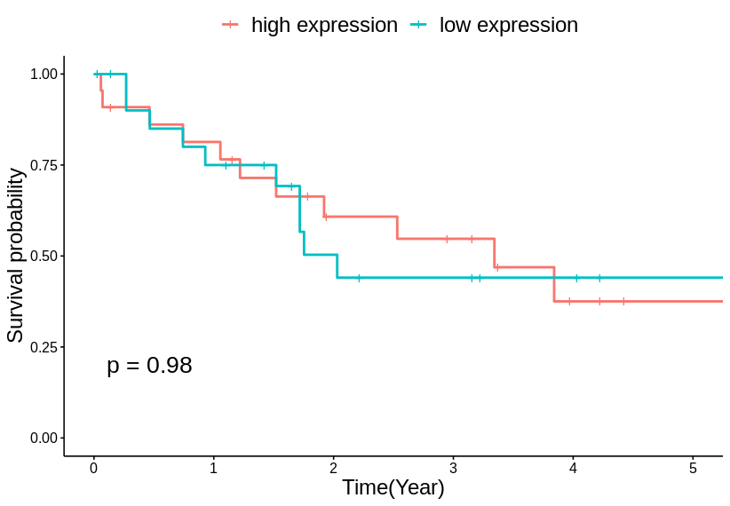

## 安装
```
if(!require(devtools)) { install.packages("devtools") }
library(devtools) 
install_github("BioinfoFungi/bioinfoR")
```
## 使用
```
library(BioinfoR)
initParam(authorization = "服务器配置",baseUrl = "默认为 http://localhost:8080/api")
showParam()
global <- globalConfig()
```
> 如果服务器请求需要授权，需要添加authorization参数，以确保正确获取数据
> 关于authorization的更多信息请看:<https://github.com/BioinfoFungi/bioinfo_server>

#### Survival analysis
```
fit <- tcgaSurvival("CHOL","TP53")
tcgaGGsurvplot(fit)
```
```
png(filename = "figure/TP53.png",width = 7,height = 7,res = 300,units = "in")
tcgaGGsurvplot(fit)
dev.off()
```
```

```


## 开发
+ There are three main ways to run roxygen:
  + roxygen2::roxygenise().
  + devtools::document().
  + Ctrl + Shift + D, if you’re using RStudio.
  
## 参考
+ <https://github.com/r-lib/httr>
